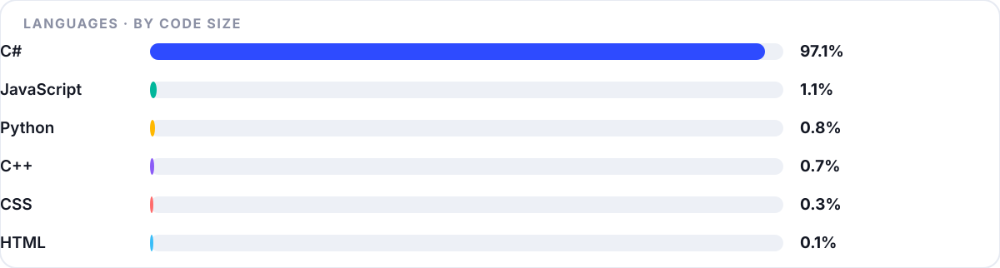

<div align="center">


<br/>

<a href="#projects"></a> <a href="#stack"></a> <a href="#stats"></a> <a href="#contact"></a>

</div>

---

## 👤 Обо мне

<table>
<tr>
<td width="128" align="center" valign="middle">
  
</td>
<td valign="middle">

### MeX · <span style="color:#2E4BFF">Mextrim</span>

🏠 Работаю из дома · 📍 Parabel
**C# / .NET 10 / WPF** — десктопные инструменты · **Rust** — аудио DSP · **JavaScript** — браузерные расширения

</td>
<td width="230" align="center" valign="middle">
  
  <br/>
  
</td>
</tr>
</table>

```csharp
var me = new Developer("Mextrim aka MeX")
{
    Location = "Parabel, работаю из дома",
    Focus    = new[] { "Desktop Tools", "GTA V Modding", "Audio DSP", "Browser Extensions" },
    Stack    = new[] { "C#", ".NET 10", "WPF / XAML", "Rust", "JavaScript" },
    Motto    = "Удобство > фичи. Один клик вместо десяти."
};
```

Сейчас в работе:

- ✂️ **[KazanClothTool](https://github.com/Mextrim/KazanClothTool)** — редактор одежды и текстур для GTA V: 35 тем, 3 языка, сборка под FiveM / Alt:V / Singleplayer
- 🎛️ **[MexPlug](https://github.com/Mextrim/MexPlug)** — VST3 / CLAP плагин: punchy auto-mix + analog liveliness на Rust, 0 аллокаций на аудио-потоке
- 💧 **[twitch-drops-farmer](https://github.com/Mextrim/twitch-drops-farmer)** — расширение для Chrome / Edge: само находит каналы с включёнными дропами и крутит их по таймеру
- 🐍 **[twitch-drops](https://github.com/Mextrim/twitch-drops)** — трекер прогресса дропсов с автоклеймом наград, сборка в один `.exe`

Люблю WPF, кастомные темы, Material Design Icons, CodeWalker и DSP. Подробная документация — в Wiki проектов.

---

## 🚀 Projects

<table>
<tr>
<td width="50%" valign="top">

**✂️ KazanClothTool** — редактор одежды и текстур для GTA V

`C#` · `.NET 10` · `WPF` · FiveM · Alt:V · Singleplayer

- 🖥️ Windows x64 · 🎨 35 тем · 🌍 RU / UA / EN без перезапуска
- 📦 Сборка: FiveM + `fxmanifest` · Alt:V + `resource.toml` · SP `dlc.rpf`
- 🧊 3D-просмотр · 💾 `.kctproject` · автосейв каждые 60 сек

[](https://github.com/Mextrim/KazanClothTool/releases)
[Repo](https://github.com/Mextrim/KazanClothTool) · [Wiki](https://github.com/Mextrim/KazanClothTool/wiki) · [Сайт](https://mextrim.github.io/KazanClothTool/)

</td>
<td width="50%" valign="top">

**🎛️ MexPlug** — punchy auto-mix + analog liveliness

`Rust` · `nice-plug` · `DSP` · VST3 · CLAP

- 🦀 ~0.33 мкс/фрейм · 🚫 0 аллокаций на аудио-потоке
- ✅ pluginval strict 5 — SUCCESS
- 🎚️ 19 ручек · 8 пресетов · DICE · A/B · 5 тем

[](https://github.com/Mextrim/MexPlug/releases)
[Repo](https://github.com/Mextrim/MexPlug) · [Releases](https://github.com/Mextrim/MexPlug/releases)

</td>
</tr>
<tr>
<td valign="top">

**💧 twitch-drops-farmer** — автофарм Twitch Drops

`JavaScript` · `Manifest V3` · Chrome / Edge 120+

- 🎯 Поиск каналов с дропами через GraphQL Twitch
- 🔄 Ротация 1–4 фоновых вкладок по таймеру
- 🔇 160p + mute · 🔔 уведомления · 🚫 стоп-слова

[](https://github.com/Mextrim/twitch-drops-farmer)
[Repo](https://github.com/Mextrim/twitch-drops-farmer) · [Release](https://github.com/Mextrim/twitch-drops-farmer/releases)

</td>
<td valign="top">

**🐍 twitch-drops** — трекер дропов с автоклеймом

`Python` · панель в браузере · один `.exe`

- 📈 Прогресс и таймеры по активным дропам
- 🤖 Автоклейм наград
- 📦 Сборка в один исполняемый файл

[](https://github.com/Mextrim/twitch-drops/releases)
[Repo](https://github.com/Mextrim/twitch-drops) · [Releases](https://github.com/Mextrim/twitch-drops/releases)

</td>
</tr>
</table>

> 🔔 **Свежий релиз:** [KazanClothTool **v1.14.0**](https://github.com/Mextrim/KazanClothTool/releases/download/v1.14.0/KazanClothTool-v1.14.0-win-x64.zip) — portable ZIP, установка не нужна.

---

## 🧰 Stack

<p align="center">
  
  
  
  
  
  
  
  
  
  
</p>

<details>
<summary><b>Детальнее по инструментам</b></summary>
<br/>

- **Desktop:** C#, .NET 10, WPF, MVVM, XAML, Win32 API
- **Audio:** Rust, nice-plug, VST3 / CLAP, DSP (saturation, tape, glue-comp, limiter), pluginval strict 5
- **Web / Extensions:** JavaScript, Manifest V3, Chrome Extensions API, GraphQL
- **GTA / Modding:** CodeWalker, YTD / YDD / YFT, meta / fxmanifest / resource.toml, dlc.rpf
- **Deploy:** GitHub Actions, NSIS Setup.exe, portable ZIP, Releases + Wiki
- **UI/UX:** 35 кастомных тем, RU / UA / EN без перезапуска, Material Design Icons 7400+

</details>

---

## 📊 Stats

<div align="center">

</div>



<details>
<summary><b>Визуальный стиль GitHub</b></summary>
<br/>

Профиль построен как дашборд: все цифры в виджетах собираются автоматически
скриптом `tools/dashboard.mjs` из GitHub API и обновляются по расписанию —
поэтому счётчики не расходятся с реальностью.

</details>

---

## 📬 Contact

<p align="center">
  <a href="https://t.me/mextrim"></a>
  &nbsp;
  <a href="https://vk.com/mextrim"></a>
  &nbsp;
  <a href="https://discord.com/users/1393850947544944650"></a>
</p>

---

<p align="center">
<sub>© 2026 MeX · виджеты генерируются автоматически · иконки: Simple Icons / Shields</sub>
</p>
