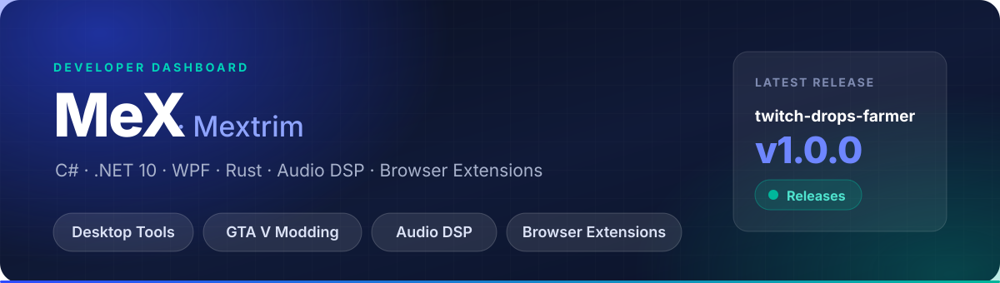
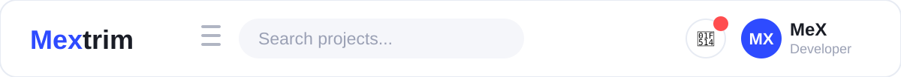
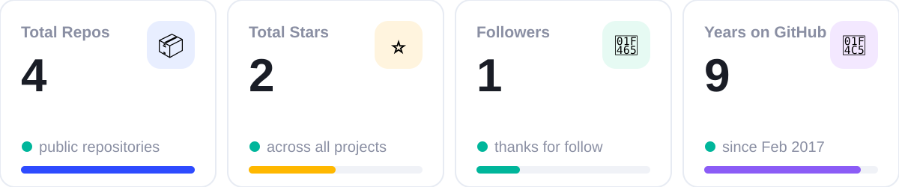

<p align="center">
  <a href="#dashboard"></a>
  <a href="#projects"></a>
  <a href="#tech-stack"></a>
  <a href="#statistics"></a>
  <a href="#contact"></a>
</p>

## Dashboard

<table>
<tr>
<td width="120" align="center" valign="middle">

</td>
<td valign="middle">

### MeX · Mextrim
🏠 Working from home · 📍 Parabel
<br/>
C# / Rust · GTA V modding · Audio DSP

</td>
<td width="220" align="center" valign="middle">

<br/>

</td>
</tr>
</table>



### 👤 User Profile

```csharp
var me = new Developer("Mextrim aka MeX")
{
    Location = "Parabel, Working from home",
    Focus = new[] { "Desktop Tools", "GTA V Modding", "Audio Plugins" },
    DailyStack = new[] { "C#", ".NET 10", "WPF / XAML", "Rust" },
    Currently = "KazanClothTool v1.14.0 + MexPlug VST3/CLAP",
    Motto = "Удобство > фичи. Один клик вместо десяти."
};
```

- Сейчас развиваю **KazanClothTool** — редактор одежды и текстур для GTA V: 35 тем, 3 языка, сборка под FiveM / Alt:V / Singleplayer
- Параллельно — **MexPlug**: VST3/CLAP плагин punchy auto-mix + analog liveliness на Rust, 0 аллокаций на аудио-потоке
- Люблю WPF, кастомные темы, Material Design Icons, CodeWalker, DSP
- Вся подробная дока — в Wiki проектов

## Projects

| Project | Stack | Ships for | Status | Link |
|---|---|---|---|---|
| **✂️ KazanClothTool** — редактор одежды и текстур для GTA V | C# · .NET 10 · WPF | FiveM · Alt:V · Singleplayer |  | [Repo](https://github.com/Mextrim/KazanClothTool) · [Wiki](https://github.com/Mextrim/KazanClothTool/wiki) |
| **🎛️ MexPlug** — punchy auto-mix + analog liveliness | Rust · nice-plug · DSP | VST3 · CLAP |  | [Repo](https://github.com/Mextrim/MexPlug) · [Releases](https://github.com/Mextrim/MexPlug/releases) |

> 🔔 **Notification · Latest Release:** [KazanClothTool **v1.14.0**](https://github.com/Mextrim/KazanClothTool/releases/download/v1.14.0/KazanClothTool-v1.14.0-win-x64.zip) — portable ZIP, установка не нужна. Интерактивная страница: [mextrim.github.io/KazanClothTool](https://mextrim.github.io/KazanClothTool/)

### KazanClothTool — детали

- 🖥️ Windows x64 · 🎨 35 тем · 🌍 RU / UA / EN без перезапуска
- 📦 Сборка: FiveM + `fxmanifest` · Alt:V + `resource.toml` · Singleplayer `dlc.rpf`
- 🧊 3D-просмотр через GTA V · 📦 `.kctproject`, автосейв каждые 60 сек

### MexPlug — детали

- 🦀 ~0.33 мкс/фрейм · 0 аллокаций на аудио-потоке · pluginval strict 5 — SUCCESS
- 🎚️ 19 ручек · 8 пресетов · DICE · A/B · 5 тем оформления
- 🖥️ FL / Ableton / Cubase / Reaper / Bitwig / Studio One

## Tech Stack

<p align="center">
  
  
  
  
  
  
  
  
  
  
</p>

<details>
<summary><b>🧰 Детальнее по инструментам</b></summary>
<br/>

- **Desktop:** C#, .NET 10, WPF, MVVM, XAML, Win32 API
- **Audio:** Rust, nice-plug, VST3 / CLAP, DSP (saturation, tape, glue-comp, limiter), pluginval strict 5
- **GTA / Modding:** CodeWalker, YTD / YDD / YFT, meta / fxmanifest / resource.toml, dlc.rpf
- **Deploy:** GitHub Actions, NSIS Setup.exe, portable ZIP, Releases + Wiki
- **UI/UX:** 35 кастомных тем, RU / UA / EN без перезапуска, Material Design Icons 7400+

</details>

## Statistics

<p align="center">
  
</p>

**Languages — deals by repo** (KazanClothTool — C#, MexPlug — Rust):

```
C#    ████████████████████  ~90%  (KazanClothTool, .NET 10 / WPF)
Rust  ████                  ~8%   (MexPlug, VST3/CLAP DSP)
CSS   █                     ~1%   (Discord-light-theme, форк)
C++   █                     ~1%   (нативный код в KazanClothTool)
```

## Contact

### Связаться со мной:

<p align="center">
  <a href="https://t.me/mextrim"></a>
  <a href="https://vk.com/mextrim"></a>
  <a href="https://discord.com/users/1393850947544944650"></a>
</p>

---

<p align="center">© 2026 MeX · Profile UI inspired by DashStack · Icons: Font Awesome / Material</p>
