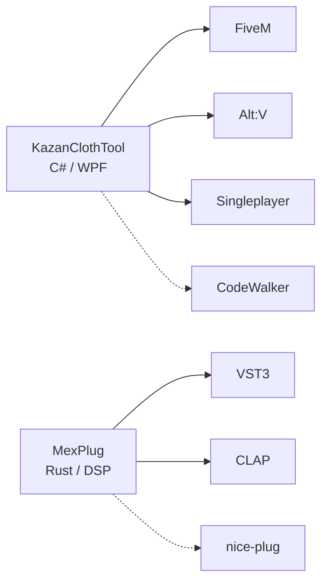

[](https://git.io/typing-svg)

<h3 align="center">MeX — делаю инструменты, которыми удобно пользоваться</h3>

<p align="center">
  <a href="https://github.com/Mextrim/KazanClothTool"></a>
  <a href="https://github.com/Mextrim/MexPlug"></a>
  
</p>

<p align="center">
  🏠 Working from home · 📍 Parabel<br/>
  C# / Rust · GTA V modding · Audio DSP
</p>

---

### Обо мне

```csharp
var me = new Developer("Mextrim aka MeX")
{
    Location = "Parabel, Working from home",
    Focus = new[] { "Desktop Tools", "GTA V Modding", "Audio Plugins" },
    DailyStack = new[] { "C#", ".NET 10", "WPF / XAML", "Rust" },
    Currently = "KazanClothTool v1.14.0 + MexPlug VST3/CLAP",
    Motto = "Удобство > фичи. Один клик вместо десяти."
};
```

- Сейчас развиваю **KazanClothTool** — редактор одежды и текстур для GTA V: 35 тем, 3 языка, сборка под FiveM / Alt:V / Singleplayer
- Параллельно — **MexPlug**: VST3/CLAP плагин punchy auto-mix + analog liveliness на Rust, 0 аллокаций на аудио-потоке
- Люблю WPF, кастомные темы, Material Design Icons, CodeWalker, DSP
- Вся подробная дока — в Wiki проектов

---

### Стек

<p align="center">
  
  
  
  
  
  
  
  
  
  
</p>

<details>
<summary><b>Детальнее по инструментам</b></summary>
<br/>

- **Desktop:** C#, .NET 10, WPF, MVVM, XAML, Win32 API
- **Audio:** Rust, nice-plug, VST3 / CLAP, DSP (saturation, tape, glue-comp, limiter), pluginval strict 5
- **GTA / Modding:** CodeWalker, YTD / YDD / YFT, meta / fxmanifest / resource.toml, dlc.rpf
- **Deploy:** GitHub Actions, NSIS Setup.exe, portable ZIP, Releases + Wiki
- **UI/UX:** 35 кастомных тем, RU / UA / EN без перезапуска, Material Design Icons 7400+

</details>

---

### Главные проекты

<table>
<tr>
<td width="50%" valign="top">

#### KazanClothTool

**Редактор одежды и текстур для GTA V**

Модели, свойства, контроль качества и сборка ресурсов — в одном окне.

- Windows x64 · .NET 10 · WPF
- 35 тем · RU / UA / EN
- Сборка: FiveM + fxmanifest · Alt:V + resource.toml · Singleplayer dlc.rpf
- 3D-просмотр через GTA V · .kctproject, автосейв 60 сек

<br/>

<a href="https://github.com/Mextrim/KazanClothTool/releases/download/v1.14.0/KazanClothTool-v1.14.0-win-x64.zip"></a>
<a href="https://github.com/Mextrim/KazanClothTool/wiki"></a>
<a href="https://github.com/Mextrim/KazanClothTool"></a>

</td>
<td width="50%" valign="top">

#### MexPlug

**Punchy auto-mix + analog liveliness**

Убирает стерильность трека: авто-сведение, лампа, tape, мастеринг — в одном окне.

- Rust · nice-plug · VST3 + CLAP
- ~0.33 мкс/фрейм · 0 аллокаций · pluginval strict 5
- 19 ручек · 8 пресетов · DICE · A/B · 5 тем
- FL / Ableton / Cubase / Reaper / Bitwig / Studio One

<br/>

<a href="https://github.com/Mextrim/MexPlug/releases"></a>
<a href="https://github.com/Mextrim/MexPlug"></a>
<a href="https://github.com/Mextrim/MexPlug/issues"></a>

</td>
</tr>
</table>

> Интерактивная страница: [mextrim.github.io/KazanClothTool](https://mextrim.github.io/KazanClothTool/)

---

### Статистика

<p align="center">
  
  
</p>

<p align="center">
  
  
</p>

---

### Направления



---

### Связь

<p align="center">
  <a href="https://github.com/Mextrim/KazanClothTool/issues"></a>
  <a href="https://github.com/Mextrim/KazanClothTool/wiki"></a>
  <a href="https://mextrim.github.io/KazanClothTool/"></a>
  <a href="https://github.com/Mextrim/MexPlug/releases"></a>
</p>

---


<p align="center">© 2026 MeX · Icons: Font Awesome / Material</p>
